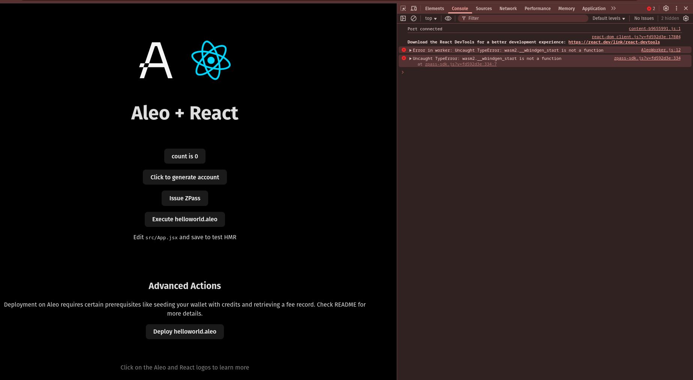
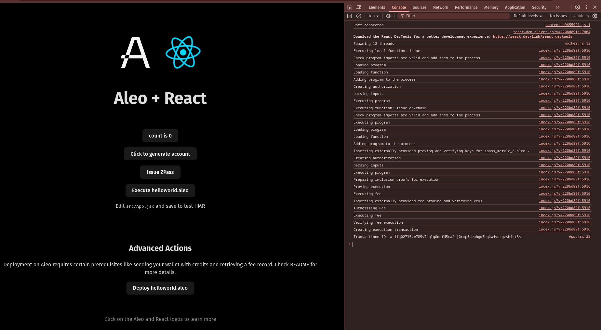

# ZPass Integration

## Create React Leo App:
- Command:
    ```sh
    npm create leo-app@latest
    ```
    
    <details><summary> Detailed Output </summary><blockquote>

    ~~~sh
    > npx
    > create-leo-app

    ✔ Project name: … gcsita_leo_zpass_integration
    ✔ Select a framework: › React
    ✔ Select a variant: › JavaScript + Leo

    Done. Now run:

    cd gcsita_leo_zpass_integration
    npm install
    npm run dev
    ~~~

    </blockquote></details>

- Install Dependencies:
    ```sh
    npm i zpass-sdk vite-plugin-wasm
    ```

## Start Project:
- Command:
    ```sh
    npm run dev
    ```
- Then, visit [http://localhost:5173](http://localhost:5173).

    

- Click in `Issue ZPass` Button:
    


- Here, in my case Transaction ID: `at1fq027l5vw705v7kglq0mdfd5ca2cj0cmp5qeahgw5hgkw4yqcgzsh4ct3s`

# Signature:

## Sign with `Transaction ID`:
- For me, program deployed Transaction ID is: `at1fq027l5vw705v7kglq0mdfd5ca2cj0cmp5qeahgw5hgkw4yqcgzsh4ct3s`. Command:
    ```sh
    leo account sign -d --private-key <redacted> --message "at1fq027l5vw705v7kglq0mdfd5ca2cj0cmp5qeahgw5hgkw4yqcgzsh4ct3s" --raw
    ```
- Output:
    ```sh
    sign15ffx0jaeftqxfmw394yckxxw7cv7vcssfqnvzfz6ecgmz3jp2up5lh6vq244snckwypzzqu2l4uxghmzp8hsvlpedqe66gtat3c8uqnu23rr6mhkgkrusjsmmc7taewueergms2yf25r2fxqy9fphr4aqrj4uvr5pmmj9hcjx0g5kvp3mxavfe7fq5ppdgjnkpyg65u0acrsc6zlfmg
    ```