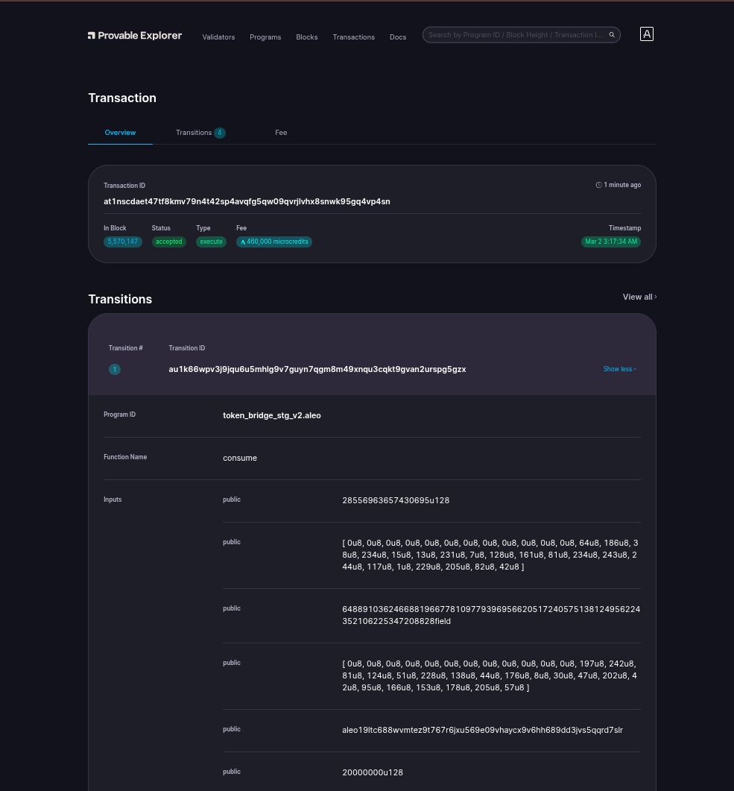

# Bridging On Aleo

- Transaction ID: `at1nscdaet47tf8kmv79n4t42sp4avqfg5qw09qvrjlvhx8snwk95gq4vp4sn`.
  
    

- Here, I transferred 20USDC from ETH Sepolia Network to ALEO Test Network.

# Signature:

## Sign with `Transaction ID`:
- For me, program deployed Transaction ID is: `at1nscdaet47tf8kmv79n4t42sp4avqfg5qw09qvrjlvhx8snwk95gq4vp4sn`. Command:
    ```sh
    leo account sign -d --private-key <redacted> --message "at1nscdaet47tf8kmv79n4t42sp4avqfg5qw09qvrjlvhx8snwk95gq4vp4sn" --raw
    ```
- Output:
    ```sh
    sign1ymk4ggrw0wh0wt79dhjvsg266xmsts2xs634paff74a77mu5uvpegurjgwyveacuwptdktd20h27xkn748xq72j7tvh3rv40vvv8gqmu23rr6mhkgkrusjsmmc7taewueergms2yf25r2fxqy9fphr4aqrj4uvr5pmmj9hcjx0g5kvp3mxavfe7fq5ppdgjnkpyg65u0acrscwwmcvf
    ```